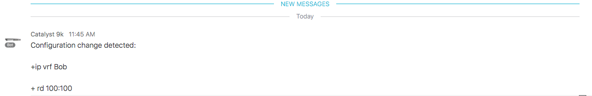

# Demo:  On-Box Python/Spark

This demo shows the interaction between on-box Python running in guestshell and Spark using REST APIs.  The demo also shows the integration between Embedded Event Manager (EEM) and on-box Python.

##  Demo Steps

1.  Log into the IOS XE device using SSH.

		ssh cisco@10.10.140.1
		
1.  Examine the EEM script.  Note that it detects a syslog message indicating a configuration change and then triggers a guestshell Python script.
		
		show run | sec event
		
		# Ouptut
		event manager applet config_change
		event syslog pattern "SYS-5-CONFIG_I"
		action 0 cli command "enable"
		action 1 cli command "guestshell run python sparkcfg.py"
		
1.  Add a VRF to the switch with your name and any rd value you would like:
	
		Switch#conf t
		Enter configuration commands, one per line.  End with CNTL/Z.
		Switch(config)#ip vrf <INSERT YOUR FIRST NAME>
		Switch(config-vrf)#rd 100:100
		Switch(config-vrf)#^Z
		
1.  Open the Spark application on the laptop if it is not already open.

	

1.  Navigate to the **Catalyst OnBox** room.

1.  You will see the change you made in the Spark room.  This was posted directly from the switch using REST APIs.

	
	
1.  Clean up the changes you made by removing your VRF.  You will also see the removed configuration posted to the Spark room.

		Switch#conf t
		Enter configuration commands, one per line.  End with CNTL/Z.
		Switch(config)#no ip vrf <INSERT YOUR FIRST NAME>
		% IPv4 addresses from all interfaces in VRF Bob have been removed
		Switch(config)#^Z
		Switch#
